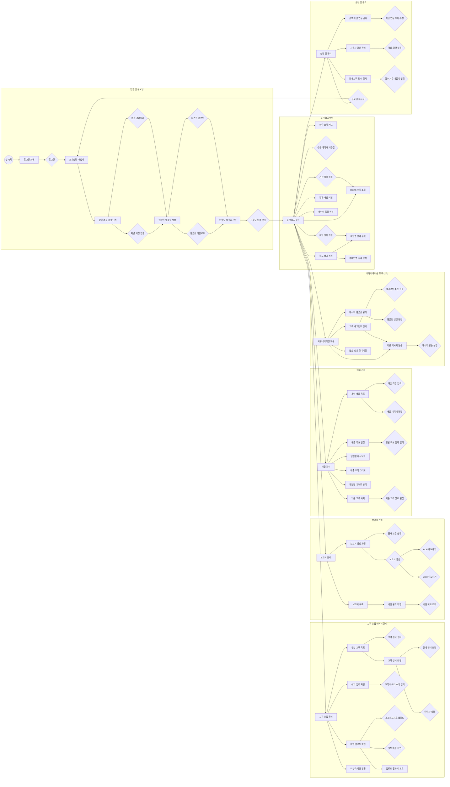

```mermaid
flowchart LR

  subgraph s1 ["인증 및 온보딩"]
    n1(("앱 시작"))
    n2["로그인 화면"]
    n3{"로그인"}
    n4["초기설정 마법사"]
    n5["광고 계정 연결 단계"]
    n6{"채널 계정 연결"}
    n7{"연결 건너뛰기"}
    n8["업로드 템플릿 설정"]
    n9{"템플릿 다운로드"}
    n10{"테스트 업로드"}
    n11["온보딩 체크리스트"]
    n12{"온보딩 완료 확인"}
  end

  subgraph s2 ["통합 대시보드"]
    n13["통합 대시보드"]
    n14["상단 요약 카드"]
    n14b{"수동 데이터 재수집"}
    n15["광고 성과 섹션"]
    n16["전환 퍼널 섹션"]
    n17["ROAS 추이 조회"]
    n18["데이터 품질 섹션"]
    n19{"기간 필터 설정"}
    n20{"채널 필터 설정"}
    n21["채널별 상세 분석"]
    n22["캠페인별 상세 분석"]
  end

  subgraph s3 ["고객 유입 데이터 관리"]
    n23["고객 유입 관리"]
    n24["유입 고객 목록"]
    n25{"고객 검색·필터"}
    n26["고객 상세 화면"]
    n27{"단계 상태 변경"}
    n28{"담당자 지정"}
    n29["수기 입력 화면"]
    n30{"고객 데이터 수기 입력"}
    n31["파일 업로드 화면"]
    n32{"스프레드시트 업로드"}
    n33{"필드 매핑 확인"}
    n34["미입력/지연 현황"]
    n34b["업로드 결과 리포트"]
  end

  subgraph s4 ["매출 관리"]
    n35["매출 관리"]
    n36["계약 매출 목록"]
    n37{"매출 직접 입력"}
    n37b{"매출 데이터 편집"}
    n38["매출 목표 설정"]
    n39{"월별 목표 금액 입력"}
    n40["달성률 대시보드"]
    n41["매출 추이 그래프"]
    n42["채널별 기여도 분석"]
    n42b["기존 고객 목록"]
    n42c{"기존 고객 정보 편집"}
  end

  subgraph s5 ["보고서 관리"]
    n43["보고서 관리"]
    n44["보고서 목록"]
    n45["보고서 생성 화면"]
    n46{"필터 조건 설정"}
    n47{"보고서 생성"}
    n48{"PDF 내보내기"}
    n49{"Excel 내보내기"}
    n50["버전 관리 화면"]
    n51{"버전 비교 조회"}
  end

  subgraph s6 ["커뮤니케이션 도구 (2차)"]
    n52["커뮤니케이션 도구"]
    n53["고객 세그먼트 선택"]
    n54{"세그먼트 조건 설정"}
    n55["메시지 템플릿 관리"]
    n56{"템플릿 생성·편집"}
    n57["타겟 메시지 발송"]
    n58{"메시지 발송 실행"}
    n59["발송 성과 모니터링"]
  end

  subgraph s7 ["설정 및 관리"]
    n60["설정 및 관리"]
    n61["광고 채널 연동 관리"]
    n62{"채널 연동 추가·수정"}
    n63["사용자 권한 관리"]
    n64{"역할·권한 설정"}
    n65["잠재고객 점수 정책"]
    n66{"점수 기준·가중치 설정"}
    n67{"온보딩 재시작"}
  end

  n1 --> n2
  n2 --> n3
  n3 --> n4
  n4 --> n5
  n5 --> n6
  n5 --> n7
  n6 --> n8
  n7 --> n8
  n8 --> n9
  n8 --> n10
  n9 --> n11
  n10 --> n11
  n11 --> n12
  n12 --> n13
  n13 --> n14
  n13 --> n15
  n13 --> n16
  n13 --> n17
  n13 --> n18
  n13 --> n19
  n13 --> n20
  n15 --> n21
  n15 --> n22
  n19 --> n17
  n20 --> n21
  n13 --> n23
  n23 --> n24
  n24 --> n25
  n24 --> n26
  n26 --> n27
  n26 --> n28
  n23 --> n29
  n29 --> n30
  n23 --> n31
  n31 --> n32
  n31 --> n33
  n23 --> n34
  n13 --> n35
  n35 --> n36
  n35 --> n38
  n38 --> n39
  n35 --> n40
  n35 --> n41
  n35 --> n42
  n13 --> n43
  n43 --> n44
  n43 --> n45
  n45 --> n46
  n45 --> n47
  n47 --> n48
  n47 --> n49
  n44 --> n50
  n50 --> n51
  n13 --> n52
  n52 --> n53
  n53 --> n54
  n52 --> n55
  n55 --> n56
  n52 --> n57
  n53 --> n57
  n57 --> n58
  n52 --> n59
  n13 --> n60
  n60 --> n61
  n61 --> n62
  n60 --> n63
  n63 --> n64
  n60 --> n65
  n65 --> n66
  n60 --> n67
  n67 --> n4
  n36 --> n37b
  n36 --> n37
  n35 --> n42b
  n42b --> n42c
  n13 --> n14b
  n31 --> n34b
```
